# CS333 - Project 1 - README
### Michael Tenkorang 
### 09/18/2025

***Google Sites Report: ***

## Directory Layout:
```
├── BankExample
├── BankExample.c
├── practice
│   ├── 2.c
│   ├── main
│   └── main.c
├── README.md
├── task1.c
├── task2.c
├── task3.c
├── task4.c
└── task5.c
```
## OS and C compiler
OS: macOS Sequoia 15.6.1
Apple clang version 15.0.0 (clang-1500.3.9.4)

## Part I 
### Task 1
**Compile:** `$ gcc task1.c -o task1`

**Run:** `$ ./task1`

**Output:**
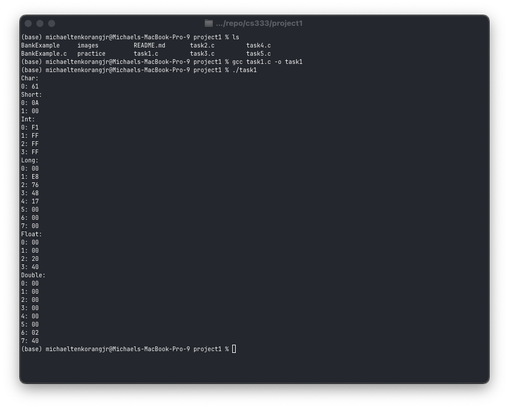

**Q.b.** 
The machine I am using is a little endian machine

**Q.c.** 
From the way it stored the value of `my_short`, it is evident that for the value `10`, the value in memory `0A` appears first in memory before the subsequent 0s.
From the definition of little-endian, since the most significant 2 bytes of my value appear first in the memory address, my machine uses little-endian.
 
### Task 2
**Compile:** `$ gcc task2.c -o task2`

**Run:** `$ ./task2`

**Output:**
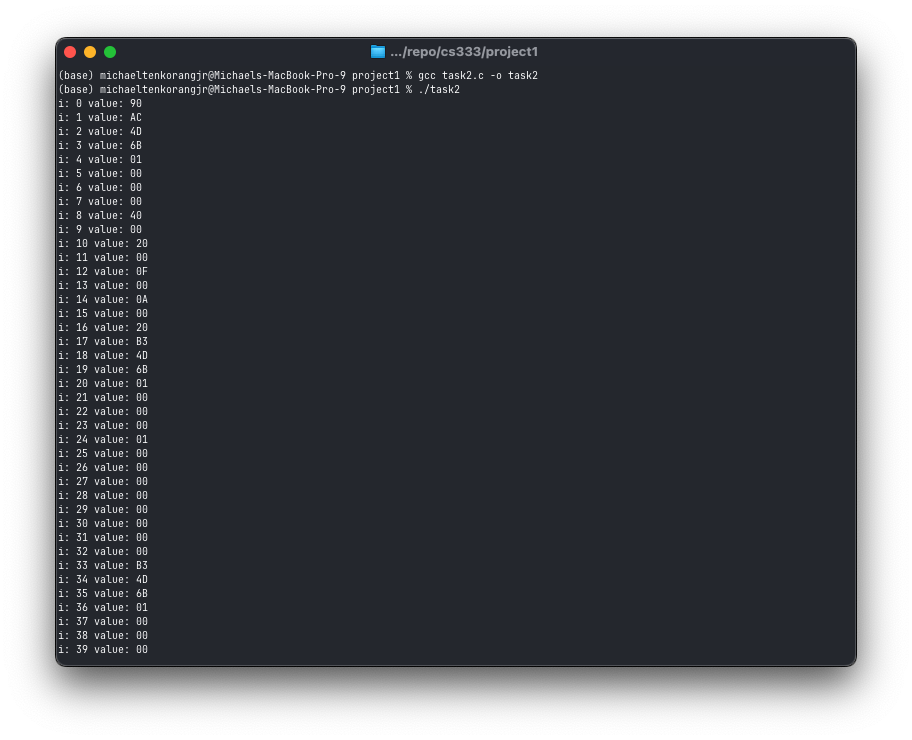

**Q.b.** 
As we move forward in reading the memory in the stack, we see the memory that has been used by instructions in our program that had been already run.

**Q. c.**
Yes. I can’t make sense of the first 8 bytes.

**Q. d.**
I can find the variables I initialized because I knew the hexadecimal representations and I knew they took 2 bytes each. To find them, I looked through the print out and intentionally looked for the pattern I was expecting “4000200004000A00”

### Task 3
**Compile:** `$ gcc task3.c -o task3`

**Run:** `$ ./task3`

**Without Free:**
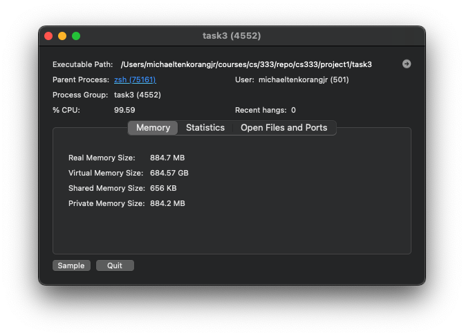

**With Free:**
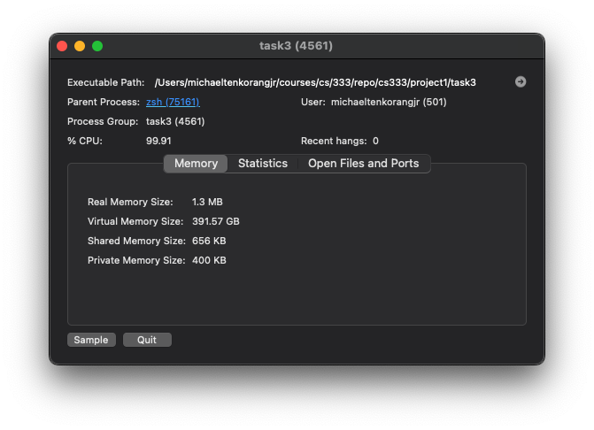

**Q.b.** 
With the `free`, the “Real Memory Size” is a lot less than when the `free` method is not used. In our case, the Real Memory Size is 884.7MB without the free and 1.3MB with free.

### Task 4
**Compile:** `$ gcc task4.c -o task4`

**Run:** `$ ./task4`

**Ordering: Char, int, short int**
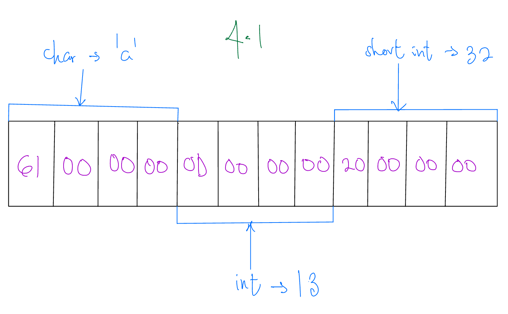

**Ordering: int, char, short int**
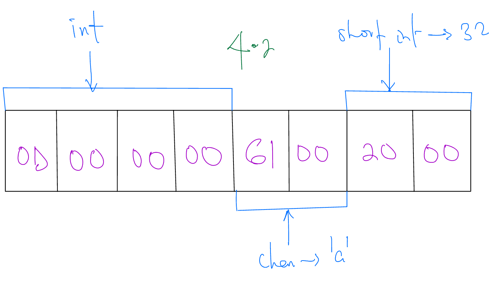

**Ordering: short int, char, int**
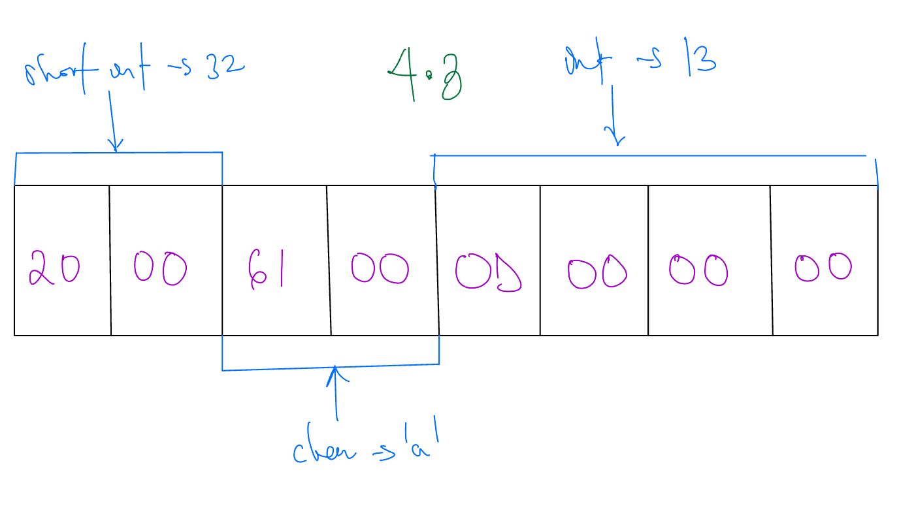

**Q.a.** 
No, it doesn’t match my expectations since the char apparently now (in 4.1) uses 4 bytes instead of 1 byte and short int uses 4 bytes instead of 1 byte. In 4.2 and 4.3 also, char uses 2 bytes instead of 1 byte.

**Q.b.** 
Yes, padding is added to char almost every single time.

### Task 5
**Compile:** `$ gcc task5.c -o task5`

**Run:** `$ ./task5`

**Q.a.**
Mike Tenkorang

**Q.b** 
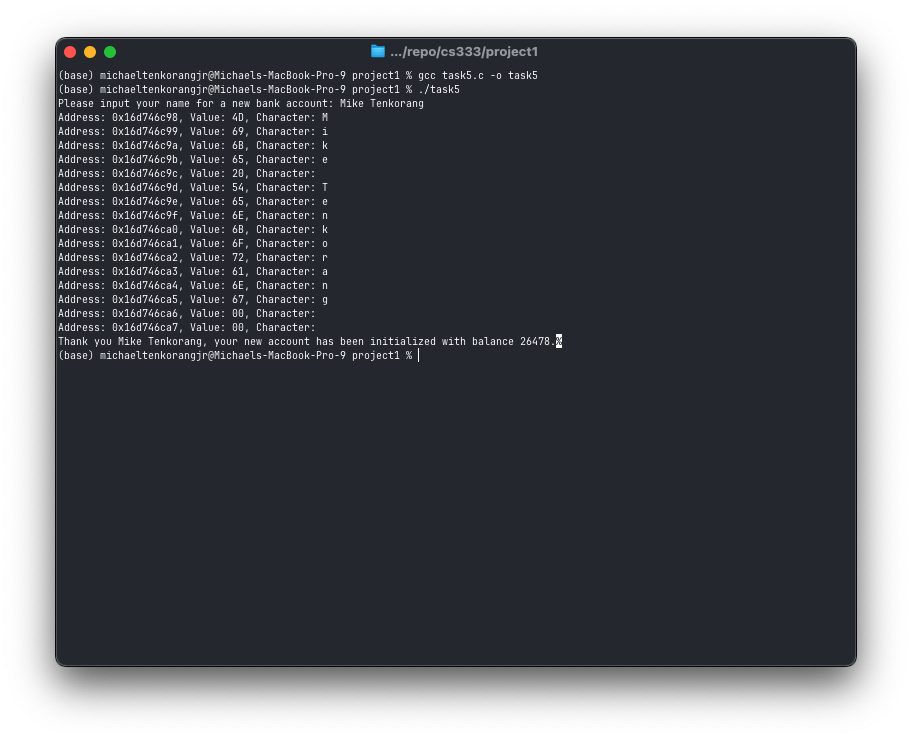

**Q.c** 
When we set the string to a value more than 9 characters, the characters are written in memory allocated for newAccount.balance.

## Extensions
### Extension 1
**Description:**
Generating a segmentation fault. I initialized a pointer to null and then set the value for the null address.

**Compile:** 
gcc -o extension1 extension1.c

**Run:** 
./extension1

**Output:**
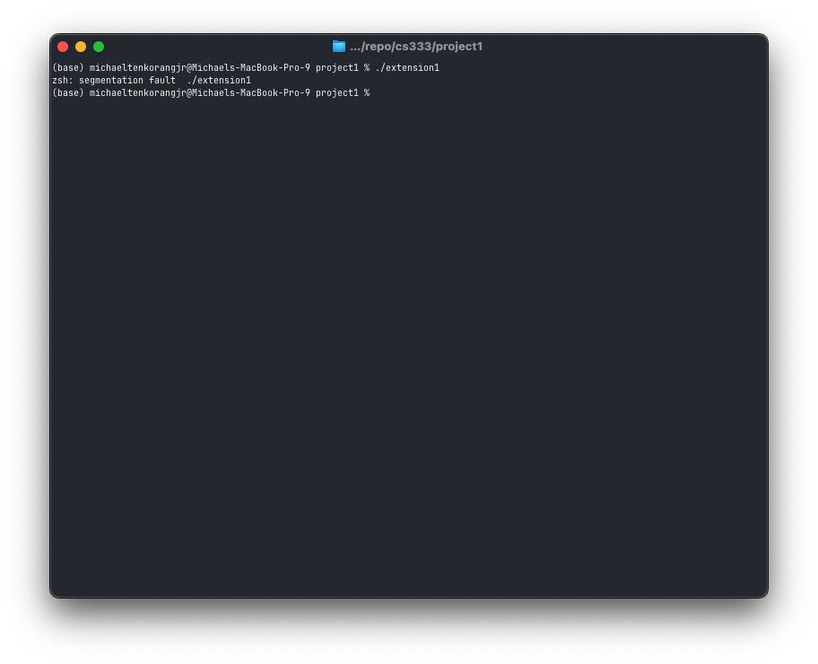

### Extension 2
**Description:**
For my second extension, I generated a buffer overread runtime error by initializing a two-integer array and accessing indices 2, 3, ..., 10. This error was not caught by the compiler. It is thus noticeable that this is something that can be leveraged for malicious purposes.

**Compile:** 
gcc -o extension2 extension2.c

**Run:** 
./extension2

**Output:**
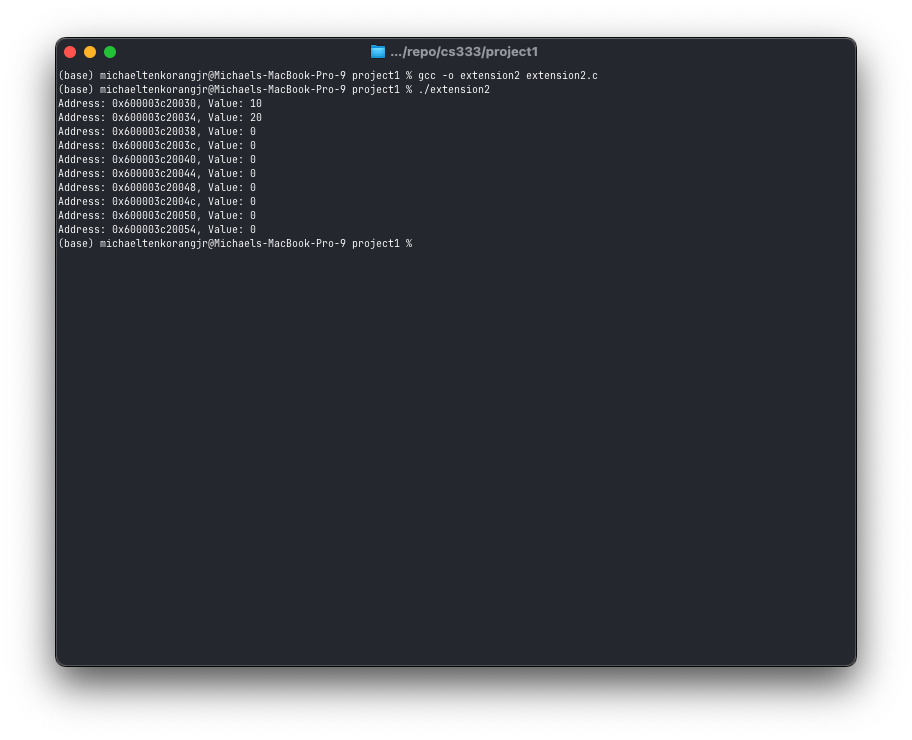


### Extension 3
**Description:**
Made Task 5 more robust by ensuring the balance is not affected by the name of the user. This was accomplished by initializing the balance before the name inside the `Account` struct definition.

**Compile:** 
gcc -o extension3 extension3.c

**Run:** 
./extension3

**Output:**
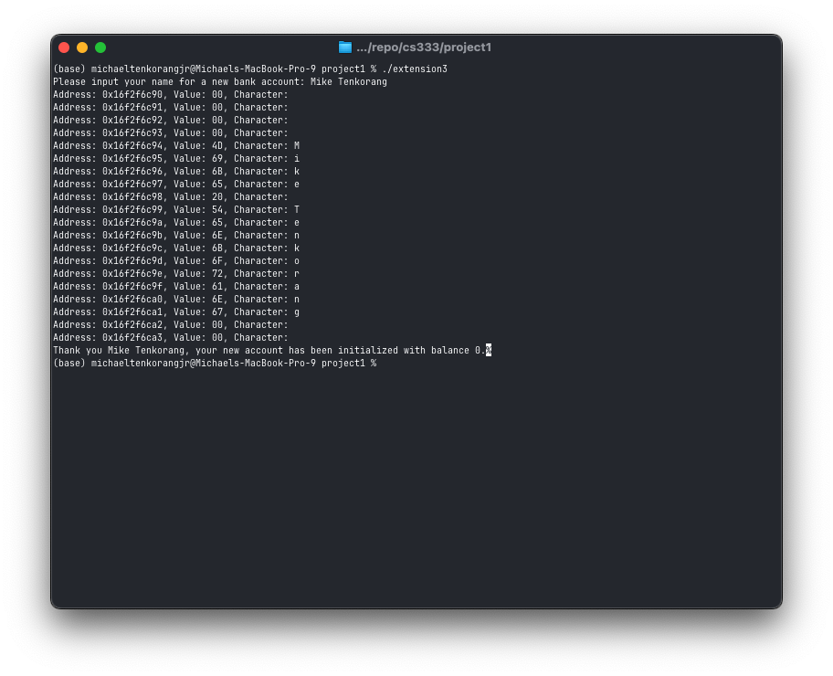

### Extension 3
**Description:**
For my final extension, I researched a fifth language which can be found here.
